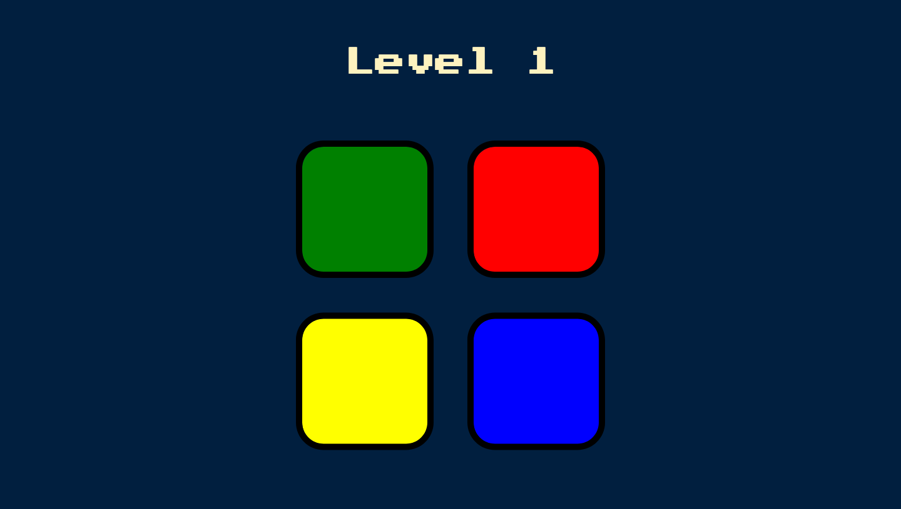
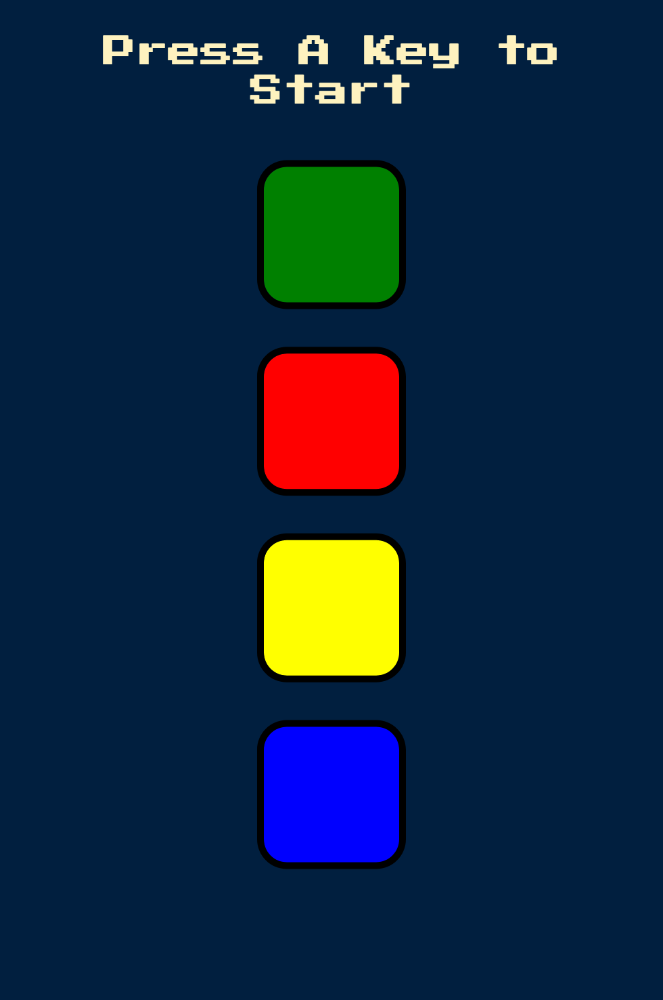

# Simon Game

This is a challenge done as part of a Udemy course on Web development.

## Table of contents

- [Overview](#overview)
  - [The challenge](#the-challenge)
  - [Screenshot](#screenshot)
- [My process](#my-process)
  - [Built with](#built-with)
- [Links](#links)
- [Author](#author)

## Overview

### The challenge

The challenge is to build out a Simon Game App. It is a classic game of memory power. The user has to just follow the device in order to win the game.The game has 4 different color buttons namely green, red, yellow, blue and sounds. The device will automatically start blinking random buttons and play sounds according to those buttons and user have to repeat the same sequence in order to advance to the next level.You have to remember a long sequence and if you get the order wrong, you lose the game.

Users should be able to:

- View the optimal layout for the app depending on their device's screen size
- Press the buttons as showed by the device to continue the game.

### Screenshot

#### Desktop Design

#### Mobile Design

### Links

- Live Site URL: [@nees101/Github]( https://nees101.github.io/Simon-Game/)

## My process

### Built with

- Semantic HTML5 markup
- CSS custom properties
- jQuery

## Author

- Github - [@nees101](https://www.github.com/nees101)
